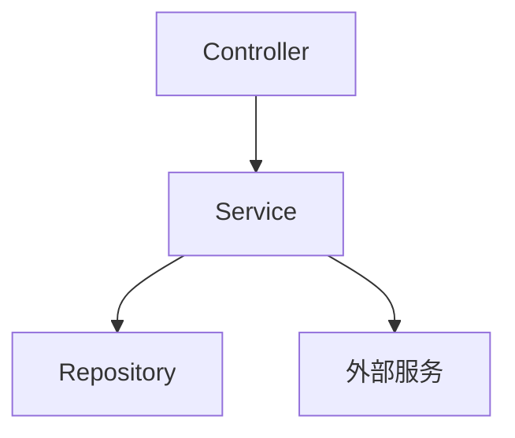
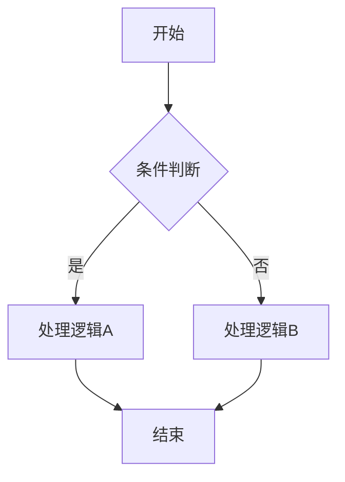

# design.md 模板

---

# [模块名] 设计文档

> 版本：v1.0
> 作者：[姓名]
> 更新日期：[日期]

---

## 1. 模块概述

### 1.1 职责定义

[模块负责的业务功能，一句话概括]

### 1.2 边界定义

| 边界类型 | 说明 |
|----------|------|
| **输入** | [数据来源：前端请求 / 消息队列 / 定时任务 / 其他模块调用] |
| **输出** | [数据去向：前端响应 / 数据库持久化 / 消息推送 / 其他模块] |
| **依赖** | [依赖的其他模块列表] |
| **被依赖** | [被哪些模块依赖] |

---

## 2. 技术设计

### 2.1 架构图

### 2.2 接口定义

#### 2.2.1 [接口名称 1]

**请求**：

| 字段 | 类型 | 必填 | 说明 |
|------|------|------|------|
| field1 | String | 是 | 字段说明 |
| field2 | Integer | 否 | 字段说明 |

**响应**：

| 字段 | 类型 | 说明 |
|------|------|------|
| code | Integer | 状态码 |
| data.field1 | String | 字段说明 |

**错误码**：

| 错误码 | 说明 |
|--------|------|
| 40001 | 参数错误 |
| 50001 | 业务异常 |

#### 2.2.2 [接口名称 2]

（同上结构）

---

### 2.3 数据结构

#### 2.3.1 数据库表设计

**表名**：`t_[table_name]`

| 字段名 | 类型 | 必填 | 默认值 | 说明 |
|--------|------|------|--------|------|
| id | VARCHAR(32) | 是 | - | 主键ID |
| [业务字段] | [类型] | [是/否] | [默认值] | [说明] |
| creator | VARCHAR(64) | 否 | NULL | 创建人 |
| updater | VARCHAR(64) | 否 | NULL | 更新人 |
| create_at | BIGINT | 否 | NULL | 创建时间（毫秒时间戳） |
| update_at | BIGINT | 否 | NULL | 更新时间（毫秒时间戳） |
| is_delete | VARCHAR(1) | 是 | 'N' | 是否删除（Y/N） |

**索引**：

| 索引名 | 类型 | 字段 | 说明 |
|--------|------|------|------|
| uk_[field] | UNIQUE | [字段] | 唯一约束 |
| idx_[field] | NORMAL | [字段] | 查询优化 |

---

### 2.4 核心逻辑

#### [逻辑名称 1]

**关键规则**：
- 规则 1：[描述]
- 规则 2：[描述]

---

## 3. 异常处理

| 异常场景 | 处理方式 | 错误码 | 用户提示 |
|----------|----------|--------|----------|
| [场景 1] | [处理方式] | [错误码] | [提示文案] |
| [场景 2] | [处理方式] | [错误码] | [提示文案] |

---

## 4. 安全性

- [ ] 接口是否有权限校验？
- [ ] 敏感数据是否脱敏？
- [ ] 写操作是否有事务保护？
- [ ] 输入是否做参数校验？

---

## 5. 性能考虑

| 场景 | 预期指标 | 优化方案 |
|------|----------|----------|
| 列表查询 | < 2s | 分页查询 + 索引 |
| 批量操作 | < 5s | 批量插入 + 事务 |

---

## 6. 扩展计划

| 扩展方向 | 说明 | 预计迭代 |
|----------|------|----------|
| [扩展 1] | [描述] | [如 v2.2] |

---

## 7. 变更记录

| 版本 | 日期 | 变更内容 | 变更人 |
|------|------|----------|--------|
| v1.0 | [日期] | 初始版本 | [姓名] |
